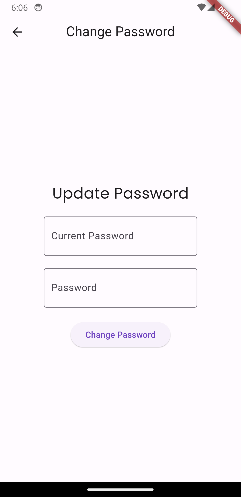

# TODO-List
This is a simple TODO-List app written using Flutter and Dart.

## Getting Started
Initialise the project by running the following command in the project directory:
```
flutter create .
```
This will create the necessary files and folders for the project to run.

## Screenshots
&nbsp;&nbsp;&nbsp;&nbsp;
&nbsp;&nbsp;&nbsp;&nbsp;
&nbsp;&nbsp;&nbsp;&nbsp;
&nbsp;&nbsp;&nbsp;&nbsp;
