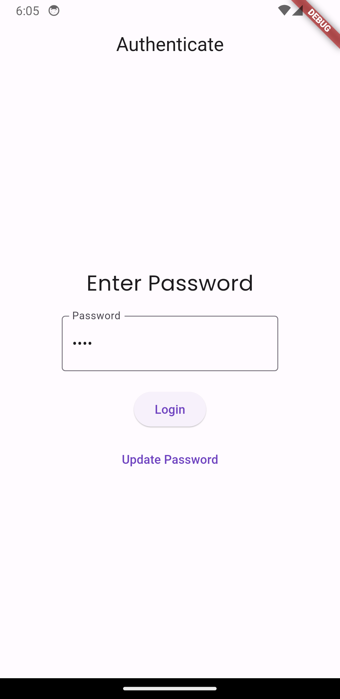

# TODO-List
This is a simple TODO-List app written using Flutter and Dart.

## Getting Started
To get started with this project:
* clone the repository.
* run `flutter pub get` to install the dependencies.
* run `flutter build apk` to build the apk file or `flutter run` to run the app on a connected device.
* Now you start using the app.

## Usage 
* Initially password is not set to anything so you can go to TO-DO list directly by clicking on the login button.
* You can change the password by clicking on the change password button on the login page. If the current password is nothing then you can leave current password field empty.

## Screenshots
&nbsp;&nbsp;&nbsp;&nbsp;
&nbsp;&nbsp;&nbsp;&nbsp;
&nbsp;&nbsp;&nbsp;&nbsp;
&nbsp;&nbsp;&nbsp;&nbsp;
